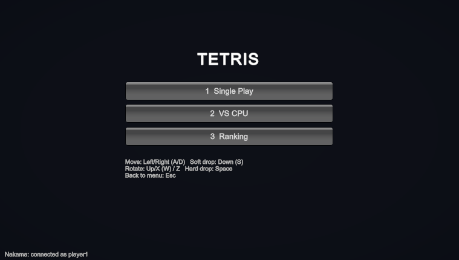
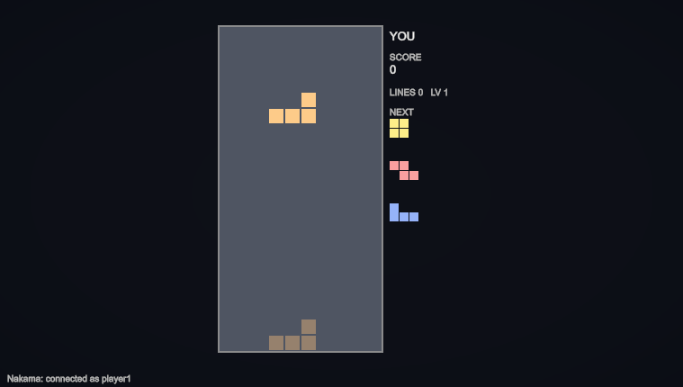
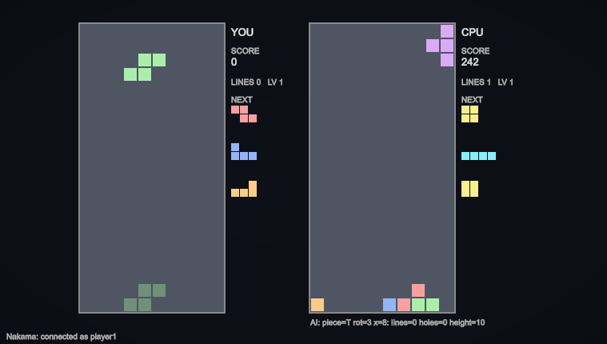
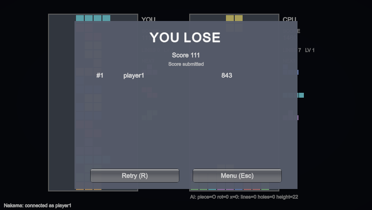
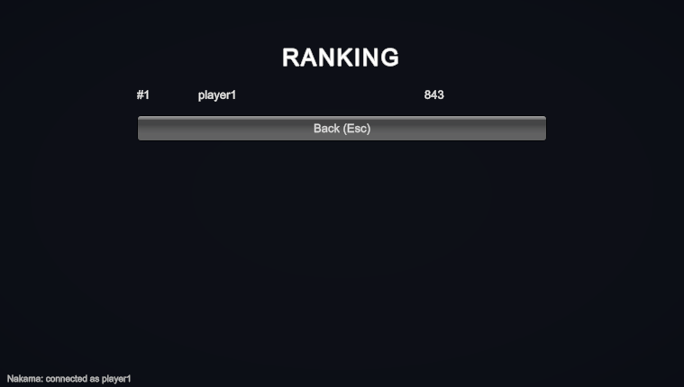

# tetris_demo

[](https://github.com/ttsukahara967/tetris_demo/actions/workflows/ci.yml)

Tetris with a single-player mode and a VS-CPU mode. The client is built with Unity, authentication and scores go through Nakama, and the CPU's decisions come from a hand-written Go server.

## Screenshots

| Menu | Single play |
|---|---|
|  |  |

| VS CPU | Result |
|---|---|
|  |  |

| Ranking |
|---|
|  |

## Layout

| Directory | Role | Runs on |
|---|---|---|
| `Assets/` `Packages/` `ProjectSettings/` | Unity client (Unity 6000.6.2f1, URP) | Unity Editor |
| `nakama/` | Nakama + PostgreSQL (authentication, leaderboard) | Docker |
| `ai-server/` | CPU opponent AI in Go (`POST /api/move`) | Docker (or `go run` on the host during development) |

## Requirements

- **Unity 6000.6.2f1**, installed through Unity Hub. Other versions may work, but Unity will offer to upgrade or downgrade the project.
- **Git on your `PATH`, and network access on the first open.** The Nakama Unity SDK is installed by the Package Manager straight from GitHub (see `Packages/manifest.json`).
- **Docker** (Docker Desktop or any engine with Compose) for Nakama and the AI server.
- Optional: Go 1.26 and the .NET 10 SDK, only if you want to run the tests outside Docker and Unity.

What works without the servers:

| Server | Without it |
|---|---|
| none | Single play works. |
| AI server (port 8090) | VS CPU still starts, but the CPU does not think: it just drops each piece where it spawns. The screen shows an "AI server error" message. |
| Nakama (port 7350) | The game plays, but scores are not submitted and the ranking is unavailable. The status line at the bottom shows "Nakama: offline". |

## Getting started

```bash
cd nakama && docker compose up -d              # Nakama + PostgreSQL
cd ai-server && docker compose up -d --build   # AI server
```

Then open `Assets/Scenes/SampleScene` in Unity and press Play, and the menu appears. No scene editing is needed:
`GameBootstrap` creates the game at runtime.

| Key | Action |
|---|---|
| Left / Right (A / D) | Move (hold to repeat) |
| Down (S) | Soft drop |
| Up / X / W, Z | Rotate clockwise, counter-clockwise |
| Space | Hard drop |
| 1 / 2 / 3 | Menu: single play / VS CPU / ranking |
| R / Esc | Result screen: retry / back to the menu |
| F12 | Editor only: save the current screen to `docs/images/` |

## Ports

| Port | Purpose |
|---|---|
| 7350 | Nakama HTTP API (what the Unity SDK connects to) |
| 7351 | Nakama Console (`admin` / `password`) |
| 7349 | Nakama gRPC |
| 8090 | Go AI server (8080 is avoided because other apps often use it) |

Connection settings and the fixed account are in [ServerConfig.cs](Assets/Scripts/Game/ServerConfig.cs).

## Tests

```bash
cd ai-server && go test ./...    # board simulation, evaluation, search, API, and a self-play run
```

The Unity core and its EditMode tests also run outside the Editor with plain `dotnet`.
With the AI server running on port 8090, this also plays a full game through the real server
to check the Unity/Go coordinate contract:

```bash
AI_SERVER_URL=http://127.0.0.1:8090 dotnet test ci/CoreTests
```

Without `AI_SERVER_URL`, the integration test is skipped. Inside Unity, use Window > General > Test Runner > EditMode
(`Assets/Tests/EditMode`: rules, board, and AI protocol tests).

CI ([ci.yml](.github/workflows/ci.yml)) runs the Go checks, builds the Docker image, and runs the dotnet tests against a freshly built AI server.
It does not build the Unity project itself, because that needs a Unity license.

## Coordinate contract between Unity and the AI server

Unity and Go must agree on all of the following.

- The board is `board[row][col]`, and row 0 is the top row. 0 = empty, 1 = block.
- Piece shapes are SRS-style `size x size` boxes (I = 4, O = 2, others = 3). `rotation` is the number of clockwise rotations, 0..3.
- `x` is **the column of the piece's leftmost cell after rotation**. The AI evaluates as if the piece is dropped straight down from the top row.
- On the Unity side, `TetrisGame.TryAlignRotation` puts the piece back at its spawn position, then the piece is moved until `LeftmostX` equals `x` and dropped.
- The shape definitions live in two places: `PieceShapes.cs` in Unity and `internal/tetris/piece.go` in Go.
  Both test suites use the same expected values, so changing only one side makes a test fail.

## Notes

- **Local development only.** The Nakama server key (`defaultkey`), the Nakama Console login (`admin` / `password`), the database password, and the fixed player account in `ServerConfig.cs` are all well-known defaults or placeholders. Change every one of them before exposing any of this beyond your own machine.
- The leaderboard `tetris_score` is created at startup by `nakama/data/modules/init.lua`
  (Nakama does not allow clients to create leaderboards).
- To call `http://localhost` from Unity, "Allow downloads over HTTP" must be enabled.
  `Assets/Scripts/Editor/ProjectSetup.cs` sets it to `Always allowed` automatically.
- The AI weights can be tuned through the constants in `ai-server/internal/ai/weights.go` alone.
- In versus mode, clearing 2 lines sends 1 garbage line to the opponent, 3 lines send 2, and 4 lines send 4 (incoming garbage is cancelled first).

## License

The original code in this repository is released under the [MIT License](LICENSE).
Unity's project template files (for example `Assets/TutorialInfo` and `Assets/Settings`) and the packages
installed through the Package Manager, including the Nakama Unity SDK, remain under their own licenses.
